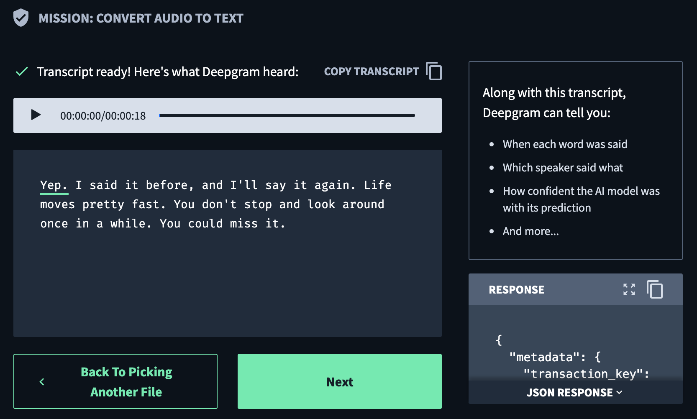
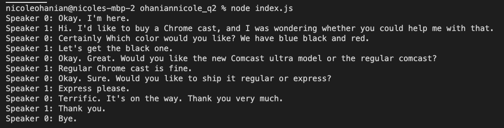

# Deepgram Take Home
## Question 2:

### Notes about My Thought Process
* I first wanted to get a basic transcript just to get the application to run. I did this by going into the documentation/console and looking up the steps to initially set up a Node.js project.

* On the upper right of this screenshot, it is advertised that multiple speakers can be transcribed. It took me a bit longer than I expected to find said feature. I think I was searching with multiple "voices" instead of "speakers" at first in the documentation, the latter of which provided me with what I was looking for. 
* I was able to get node-jq running on my computer and am experimenting with filters to try and format the information in the desired format
* I added on utterances as true in the options so that the transcript could be punctuated and each line of text could be served as a whole. Without utterances, diarized only provided the an object going word by word with the speaker.
* I used node-jq to simplifiy the object, but then realized it was outputting a string. I made the filter output the object into an array so that it could be parsed into a JSON object.
  * In retrospect, I feel that I did not completely need node-jq for this exercise, because the utterances objects came out clearly enough as it was and could easily be looped through. But perhaps cleaning it up helps reduce size of the object to the bare necessities and enhances the readability of the code.
* I looped through the JSON object to beautify the output, and was able to come up with the following:
